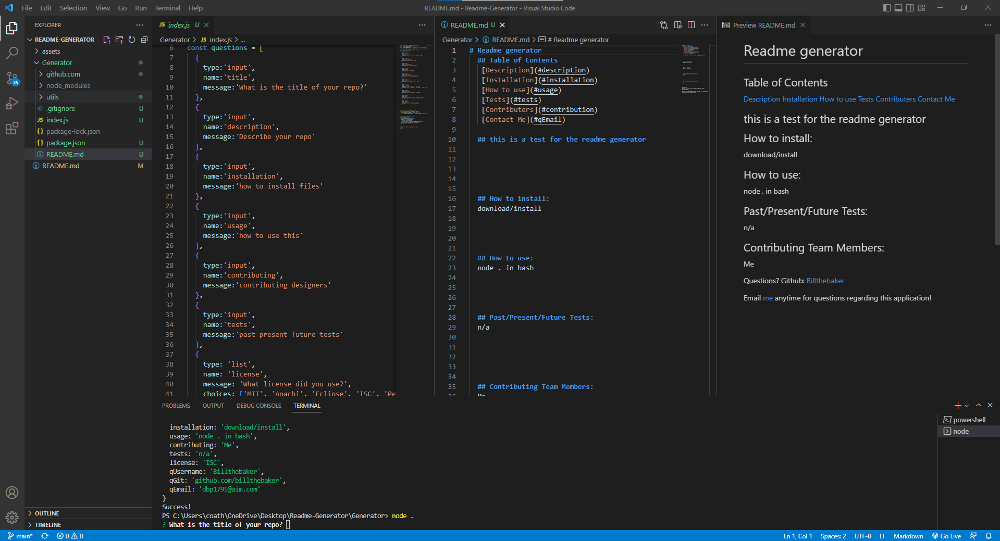

# README GENERATOR

## what this is:
This is an application that will generate a readme based upon the answers you put into the command prompt after is has asked you several questions.
The motivation for making this project was to build onto my portfolio and show future employers that i have the ability to make programs using Node.js and to build upon this later and possibly save time making README's.

This application solved the problem of having to type out the same template every time for a readme, and will save lots of time for every project that you make.

Through making this project i learned alot about how to use node.js and how to import modules, as well as learn how to make an application that can make life alot easier for me as a coder in the future.

## Installation

to install you just need to open this file up in your code editor, and run "Node ." or "Node index.js" and you shall see questions appear in the command prompt of your code editor.

<iframe src="https://drive.google.com/file/d/1B8EMzjmn7NxkszUFO0Zpkl2txieMICzW/preview" width="640" height="480" allow="autoplay"></iframe>